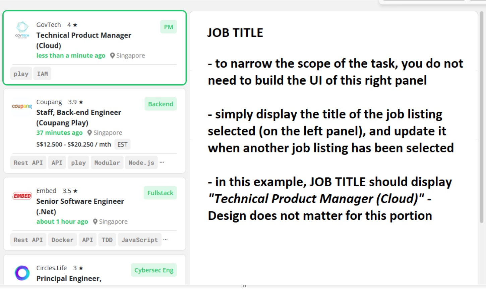
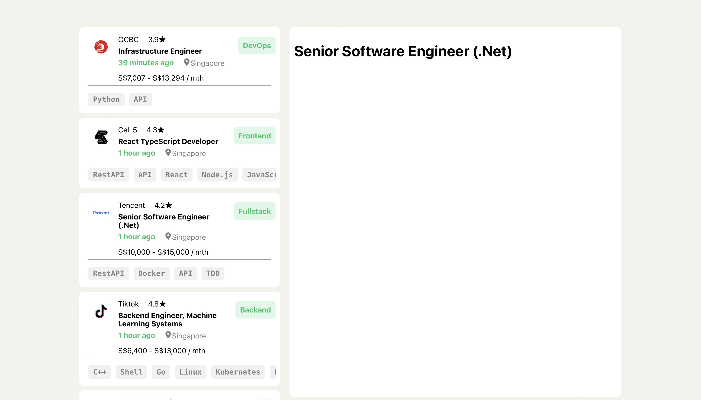
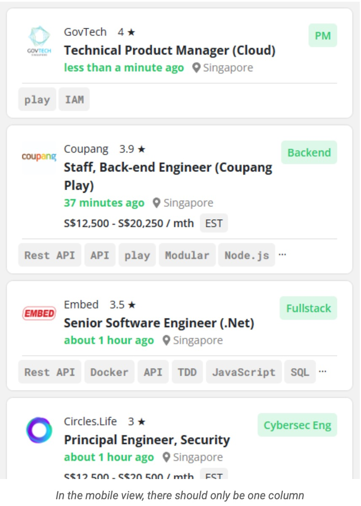
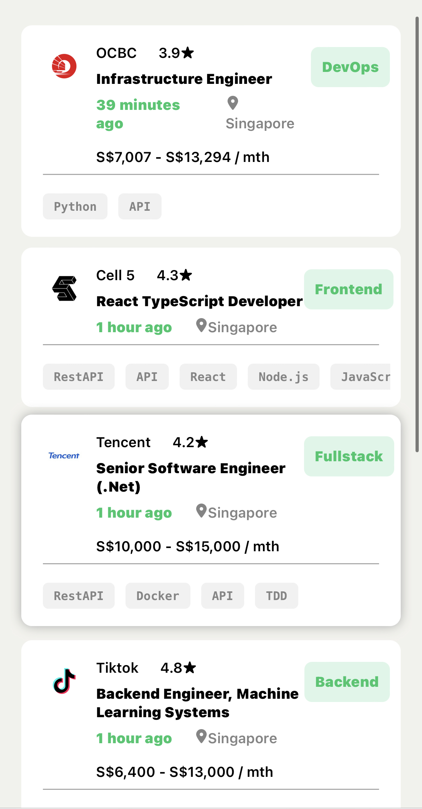

# NodeFlair Frontend Technical Assessment

### **Motivation:**

The task was to recreate a portion of the "jobs" section on NodeFlair's website. This section consists of a scrollable list view of jobs as the left section, and a description section as the right section. Upon clicking on a job, its details should appear on the description section. The job data used is hardcoded.

### **Development:**

I used React to design the components. Card animation was done using CSS transitions. I abstracted the data into a different file and represented it using an array of objects. The project is written in TypeScript to ensure type safety for the data, and to produce robust, bug-free code. 

### Images:

Instruction:

My Attempt:

Instruction (Mobile):

My Attempt (Mobile):

### Website:

The Website is live at [keaganpzh-nodeflair-ta.vercel.app](https://keaganpzh-nodeflair-ta.vercel.app/ "https://keaganpzh-nodeflair-ta.vercel.app")
